# OSRSMousePack
A series of mouse cursors to replace the default windows ones, and scripts to set/remove the cursors

The mouse cursors are as follows:

| Cursor Name | Default Cursor | Pack Cursor |
| --------- | ------- | ------- |
|IDC_ARROW|| 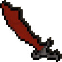 |
|IDC_IBEAM|  |  |
|IDC_WAIT|  | 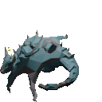 |
|IDC_CROSS|  |  |
|IDC_UPARROW|  |  |
|IDC_SIZENWSE|  | 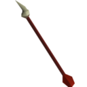 |
|IDC_SIZENESW|  | 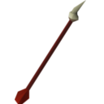 |
|IDC_SIZEWE|  | 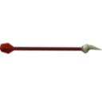 |
|IDC_SIZENS|  | 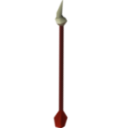 |
|IDC_SIZEALL|  | 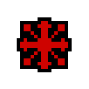 |
|IDC_NO|  |  |
|IDC_HAND|  | 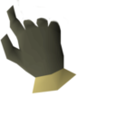 |
|IDC_APPSTARTING|  | 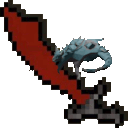 |
|IDC_HAIDC_HELPND|  | 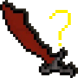 |
|IDC_PIN|  | 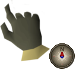 |
|IDC_PERSON|  | 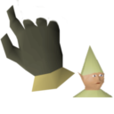 |
| MAKEINTRESOURCE(32631) |  | 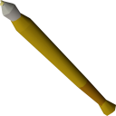 |
